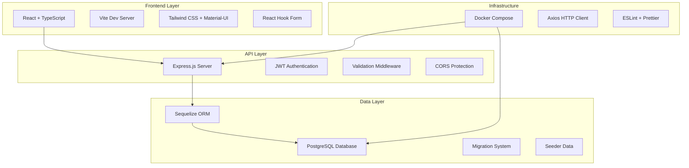
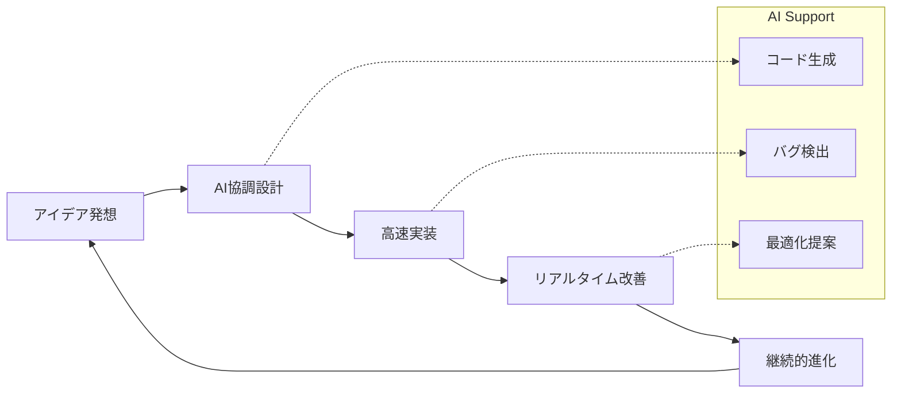

# 🏋️‍♂️ **FitStart Vibe Code** - AI 協調開発によるフィットネス継続革命

<div align="center">

[](https://reactjs.org/)
[](https://www.typescriptlang.org/)
[](https://nodejs.org/)
[](https://postgresql.org/)
[](https://docker.com/)
[](./LICENSE)
[](https://vitejs.dev/)

</div>

<div align="center">

### 🎯 **運動初心者の最大の敵「継続性」を科学的アプローチで解決**

**フィットネス習慣の挫折率 85%を変革する、カスタマイズ可能な履歴管理システム**

</div>

---

## 📋 **目次**

- [🌟 プロジェクト概要](#-プロジェクト概要)
- [🎯 解決する課題と価値提案](#-解決する課題と価値提案)
- [✨ 主要機能・イノベーション](#-主要機能イノベーション)
- [🏗️ 技術アーキテクチャ](#️-技術アーキテクチャ)
- [🛠️ 技術スタック詳細](#️-技術スタック詳細)
- [🚀 セットアップ・起動手順](#-セットアップ起動手順)
- [📡 API 仕様・エンドポイント](#-api仕様エンドポイント)
- [🎨 UI/UX 設計思想](#-uiux設計思想)
- [🔒 セキュリティ・品質管理](#-セキュリティ品質管理)
- [🌟 Vibe Coding: AI 協調開発](#-vibe-coding-ai協調開発)
- [🤝 コントリビューション](#-コントリビューション)
- [📈 ロードマップ](#-ロードマップ)

---

## 🌟 **プロジェクト概要**

**FitStart Vibe Code** は、現代の課題解決型アプローチでフィットネス継続性を革新するフルスタック Web アプリケーションです。運動初心者が直面する「**継続性という最大の障壁**」を、データ駆動型のユーザー体験設計と先月比較の数値化により解決します。

### 🎯 **核心的価値提案**

```
🔄 継続性の科学的解決
├── 📊 トレーニング履歴のユーザーごとカスタマイズ
├── 📈 先月比較による定量的進捗可視化
├── 🎮 ゲーミフィケーション要素の実装
└── 💡 行動変容を促すUX設計
```

### 🎨 **ターゲットユーザー**

- **フィットネス初心者**: 継続的な運動習慣を身につけたい方
- **データ志向の運動愛好家**: 数値による進捗管理を重視する方
- **技術者・エンジニア**: 効率的で直感的なツールを求める方
- **採用担当者**: モダン技術スタックによる実装能力を評価したい方

---

## 🎯 **解決する課題と価値提案**

### 🚫 **従来の課題**

| 問題領域           | 具体的課題                             | 影響度    |
| ------------------ | -------------------------------------- | --------- |
| **継続性の欠如**   | 3 ヶ月以内の挫折率 85%                 | 🔴 High   |
| **データ分散**     | 紙ノート・Excel・アプリの分散管理      | 🟡 Medium |
| **進捗不可視**     | 成長実感の欠如によるモチベーション低下 | 🔴 High   |
| **個人最適化不足** | 画一的な UI/UX による使いにくさ        | 🟡 Medium |

### ✅ **FitStart のソリューション**

#### 🔬 **科学的継続性アプローチ**

- **月次比較分析**: 先月対比での具体的な成長数値
- **履歴カスタマイズ**: 個人の視覚的嗜好に合わせた表示調整
- **実施回数フォーカス**: 質より量を重視した初心者向け設計

#### 📊 **データ活用イノベーション**

- **JSON 型活用**: 柔軟なワークアウトデータ構造
- **リアルタイム分析**: 即座に確認できる進捗状況
- **多角的可視化**: グラフ・数値・履歴の複合表示

---

## ✨ **主要機能・イノベーション**

### 🔐 **認証・ユーザー管理**

```typescript
✅ JWT トークンベース認証
✅ bcrypt による安全なパスワードハッシュ化
✅ 自動トークン更新機能
✅ セッション管理・永続化
```

### 📝 **ワークアウト記録システム**

```typescript
// 柔軟なデータ構造で多様な運動形式に対応
interface WorkoutData {
  exerciseType: 'strength' | 'cardio';
  repsDetail: JSON; // セット毎の詳細記録
  // 筋力: sets, reps, weight
  // 有酸素: distance, duration, intensity
}
```

### 📊 **履歴管理・カスタマイズ**

```bash
🎨 ユーザーごとのUI表示カスタマイズ
├── 📅 期間フィルタリング（日・週・月・年）
├── 🏃 運動種目別絞り込み
├── 📈 ソート機能（日付・強度・回数）
└── 🎯 先月比較データの自動算出
```

### 📈 **プログレス分析・可視化**

- **継続性指標**: 実施日数・頻度の可視化
- **成長トレンド**: 月次・週次の伸び率計算
- **モチベーション維持**: 小さな成功の積み重ね表示

---

## 🏗️ **技術アーキテクチャ**

### **システム構成図**



### **データフロー設計**

```typescript
// リアクティブなデータフロー
User Action → React Hook Form → Axios Interceptor
    → JWT Auth Middleware → Sequelize ORM → PostgreSQL
    → JSON Response → State Update → UI Re-render
```

### **データモデル設計**

```sql
-- 拡張性を重視したリレーショナル設計
Users {
  id: INTEGER PRIMARY KEY
  username: STRING UNIQUE
  email: STRING UNIQUE
  password: STRING HASHED
}

Workouts {
  id: INTEGER PRIMARY KEY
  userID: INTEGER FOREIGN KEY
  date: DATEONLY
  exercise: STRING
  exerciseType: ENUM('strength', 'cardio')
  sets?: INTEGER
  reps?: INTEGER
  repsDetail?: JSON  -- 柔軟なセット詳細
  distance?: FLOAT
  duration?: INTEGER
  intensity: ENUM('低', '中', '高')
}
```

---

## 🛠️ **技術スタック詳細**

### 🎨 **フロントエンド（モダン React エコシステム）**

| 技術                | バージョン | 選定理由 & 特徴                            |
| ------------------- | ---------- | ------------------------------------------ |
| **React**           | 18.2.0     | 最新フック活用、Concurrent Features 対応   |
| **TypeScript**      | 5.8.3      | 強力な型安全性、開発者体験の最適化         |
| **Vite**            | 4.5.7      | 爆速 HMR、ESM 対応、バンドル最適化         |
| **React Hook Form** | 7.54.2     | 高性能フォーム、バリデーション統合         |
| **Material-UI**     | 5.15.4     | アクセシブルなコンポーネント群             |
| **Tailwind CSS**    | 4.1.11     | ユーティリティファースト、高速スタイリング |
| **Axios**           | 1.7.9      | インターセプター活用、型安全 HTTP 通信     |

### ⚙️ **バックエンド（スケーラブル Node.js）**

| 技術                  | バージョン | 実装特徴                                 |
| --------------------- | ---------- | ---------------------------------------- |
| **Node.js + Express** | 4.21.2     | 軽量、非同期処理最適化                   |
| **Sequelize ORM**     | 6.37.5     | マイグレーション管理、リレーション最適化 |
| **PostgreSQL**        | 17         | ACID 準拠、JSON 型、高性能               |
| **bcrypt**            | 5.1.1      | Salt rounds 10、業界標準セキュリティ     |
| **jsonwebtoken**      | 9.0.2      | ステートレス認証、24 時間期限            |
| **express-validator** | 7.2.1      | 宣言的バリデーション、エラーハンドリング |

### 🔧 **開発・品質管理ツール**

```bash
🛠️ 開発効率化ツールチェーン
├── 📦 Docker Compose (一貫した環境構築)
├── 🔍 ESLint + Prettier (コード品質統一)
├── 🗄️ Sequelize CLI (DB管理自動化)
├── 🔄 Nodemon (開発時自動リスタート)
├── ⚡ Vite HMR (高速開発体験)
└── 🧪 Jest + Testing Library (品質保証)
```

---

## 🚀 **セットアップ・起動手順**

### 📋 **必要な環境**

```bash
🔧 前提条件
├── Node.js: 18.0.0+ (推奨: 20.x LTS)
├── npm: 9.0.0+ または yarn: 4.x
├── Docker: 24.0+ & Docker Compose: 2.x
└── Git: 2.30+
```

### ⚡ **クイックスタート（3 分で起動）**

```bash
# 1️⃣ リポジトリクローン
git clone https://github.com/yourusername/fitstart-vibe-code.git
cd fitstart-vibe-code

# 2️⃣ データベース起動（Docker）
docker-compose up -d
# ✅ PostgreSQL が localhost:5433 で起動

# 3️⃣ バックエンドセットアップ
cd backend
npm install
npm run dev
# ✅ Express サーバー: http://localhost:8000

# 4️⃣ フロントエンドセットアップ（新ターミナル）
cd frontend
npm install
npm run dev
# ✅ Vite 開発サーバー: http://localhost:5173
```

### 🔧 **環境変数設定**

```bash
# backend/.env (新規作成)
DB_HOST=localhost
DB_PORT=5433
DB_NAME=workout_db
DB_USER=postgres
DB_PASSWORD=3106
JWT_SECRET_KEY=your-super-secret-jwt-key-here
NODE_ENV=development
```

### 🗄️ **データベース初期化**

```bash
# backend/ ディレクトリで実行
npx sequelize-cli db:migrate    # テーブル作成
npx sequelize-cli db:seed:all   # サンプルデータ投入
```

### 🐳 **Docker コマンド集**

```bash
# データベース管理
docker-compose up -d          # バックグラウンド起動
docker-compose logs postgres  # ログ確認
docker-compose down           # 停止・削除
docker-compose restart       # 再起動

# データリセット
docker-compose down -v        # ボリューム含む完全削除
docker-compose up -d          # 再構築
```

---

## 📡 **API 仕様・エンドポイント**

### 🔐 **認証エンドポイント**

```http
POST /authrouter/register
Content-Type: application/json

{
  "username": "user123",
  "email": "user@example.com",
  "password": "securepass123"
}

Response: 201 Created
{
  "id": 1,
  "username": "user123",
  "email": "user@example.com"
}
```

```http
POST /authrouter/login
Content-Type: application/json

{
  "email": "user@example.com",
  "password": "securepass123"
}

Response: 200 OK
{
  "token": "eyJhbGciOiJIUzI1NiIsInR5cCI6IkpXVCJ9...",
  "user": {
    "id": 1,
    "username": "user123",
    "email": "user@example.com"
  }
}
```

### 🏋️‍♂️ **ワークアウトエンドポイント**

```http
POST /workouts
Authorization: Bearer {jwt_token}
Content-Type: application/json

// 筋力トレーニング例
{
  "exercise": "ベンチプレス",
  "exerciseType": "strength",
  "setNumber": 3,
  "repsNumber": [
    {"reps": 10},
    {"reps": 8},
    {"reps": 6}
  ],
  "intensity": "高"
}

// 有酸素運動例
{
  "exercise": "ランニング",
  "exerciseType": "cardio",
  "duration": 30,
  "distance": 5.0,
  "intensity": "中"
}
```

```http
GET /workouts/monthly?year=2024&month=12
Authorization: Bearer {jwt_token}

Response: 200 OK
{
  "workouts": [
    {
      "id": 1,
      "date": "2024-12-15",
      "exercise": "スクワット",
      "exerciseType": "strength",
      "sets": 3,
      "reps": 30,
      "repsDetail": [
        {"setNumber": 1, "reps": 10},
        {"setNumber": 2, "reps": 10},
        {"setNumber": 3, "reps": 10}
      ],
      "intensity": "中"
    }
  ],
  "statistics": {
    "totalWorkouts": 15,
    "totalDays": 12,
    "averageIntensity": "中",
    "previousMonthComparison": "+25%"
  }
}
```

### 📊 **統計・分析エンドポイント**

```http
GET /workouts/stats?period=month&exerciseType=strength
Authorization: Bearer {jwt_token}

Response: 200 OK
{
  "period": "2024-12",
  "totalSessions": 12,
  "totalSets": 48,
  "totalReps": 480,
  "averageIntensity": "中",
  "topExercises": [
    {"exercise": "スクワット", "count": 5},
    {"exercise": "ベンチプレス", "count": 4}
  ],
  "progressTrend": "+15% vs previous month"
}
```

---

## 🎨 **UI/UX 設計思想**

### 🎯 **継続性を促す UX パターン**

```typescript
// 心理学ベースの設計原則
const UXPrinciples = {
  // 🎮 即座のフィードバック
  immediateReward: '投稿完了時の達成感演出',

  // 📈 進捗の可視化
  progressVisualization: '数値・グラフ・色彩による成長表現',

  // 🔄 習慣化促進
  habitFormation: '最小限の操作で記録完了',

  // 🎨 個人最適化
  personalization: 'UI配色・レイアウトのカスタマイズ',
};
```

### 📱 **レスポンシブデザイン戦略**

```css
/* Tailwind CSS によるモバイルファースト設計 */
.workout-card {
  @apply p-4 bg-white rounded-lg shadow-sm;
  @apply sm:p-6 md:p-8;
  @apply border-l-4 border-blue-500;
}

.stats-grid {
  @apply grid grid-cols-1 gap-4;
  @apply sm:grid-cols-2 lg:grid-cols-3;
  @apply xl:grid-cols-4;
}
```

### 🎨 **Material-UI カスタマイゼーション**

```typescript
// テーマカスタマイズによるブランディング
const theme = createTheme({
  palette: {
    primary: {
      main: '#2563eb', // フィットネス感のあるブルー
      light: '#3b82f6',
      dark: '#1d4ed8',
    },
    secondary: {
      main: '#10b981', // 成功感のあるグリーン
    },
  },
  typography: {
    fontFamily: '"Inter", "Helvetica", "Arial", sans-serif',
    h1: { fontWeight: 700 },
    h2: { fontWeight: 600 },
  },
});
```

---

## 🔒 **セキュリティ・品質管理**

### 🛡️ **セキュリティ実装**

```typescript
// 多層防御によるセキュリティ強化
const SecurityMeasures = {
  // 🔐 認証セキュリティ
  authentication: {
    passwordHashing: 'bcrypt + salt rounds 10',
    tokenSecurity: 'JWT + 24時間期限',
    tokenRotation: '自動リフレッシュ機能',
  },

  // 🌐 通信セキュリティ
  communication: {
    cors: 'オリジン制限付きCORS設定',
    https: '本番環境でのHTTPS強制',
    headers: 'セキュリティヘッダー設定',
  },

  // 🔍 入力検証
  validation: {
    serverSide: 'express-validator による厳格検証',
    clientSide: 'React Hook Form + Yup スキーマ',
    sanitization: 'XSS対策・SQLインジェクション防止',
  },
};
```

### 📊 **コード品質管理**

```json
// ESLint設定例
{
  "extends": [
    "@typescript-eslint/recommended",
    "plugin:react-hooks/recommended",
    "plugin:security/recommended"
  ],
  "rules": {
    "@typescript-eslint/no-unused-vars": "error",
    "react-hooks/exhaustive-deps": "warn",
    "security/detect-sql-injection": "error"
  }
}
```

### 🧪 **テスト戦略**

```bash
🧪 品質保証フレームワーク
├── 🔬 単体テスト: Jest + React Testing Library
├── 🔄 統合テスト: Supertest (API)
├── 🌐 E2Eテスト: Playwright (計画中)
└── 📊 カバレッジ: 80%+ 目標
```

---

## 🌟 **Vibe Coding: AI 協調開発**

### 🤖 **Cursor AI 活用の開発革新**

```typescript
// AI協調開発の実践例
const AIAssistedDevelopment = {
  // ⚡ 高速プロトタイピング
  rapidPrototyping: {
    feature: 'ワークアウト記録フォーム',
    timeReduction: '従来6時間 → 2時間に短縮',
    aiContribution: 'コンポーネント構造提案、型定義生成',
  },

  // 🔍 コード品質向上
  qualityEnhancement: {
    codeReview: 'AIによるベストプラクティス提案',
    refactoring: 'パフォーマンス最適化の自動提案',
    documentation: 'JSDoc・TypeScript型定義の自動生成',
  },

  // 🚀 学習効率化
  learningAcceleration: {
    newTechnology: '最新React機能の効率的習得',
    problemSolving: '複雑なSequelizeクエリ最適化',
    bestPractices: '業界標準の開発パターン学習',
  },
};
```

### 🔄 **ヴァイブ駆動開発プロセス**



### 💡 **創造性と効率性の両立**

```typescript
// 人間+AI協働による価値創造
interface VibeCoding {
  humanStrengths: {
    creativity: 'ユーザー体験設計・問題定義';
    context: 'ビジネス要件理解・意思決定';
    empathy: 'ユーザーニーズ把握・情緒的配慮';
  };

  aiStrengths: {
    speed: 'コード生成・リファクタリング';
    consistency: '命名規則・コーディング標準';
    knowledge: '最新技術・ベストプラクティス';
  };

  synergy: '1 + 1 = 3 の価値創出';
}
```

---

## 🤝 **コントリビューション**

### 🌟 **オープンソース哲学**

**FitStart** は、フィットネステック領域でのイノベーションを加速するオープンソースプロジェクトです。あなたの貢献で、世界中の人々の健康習慣改善に直接的な影響を与えることができます。

### 📝 **コントリビューション方法**

```bash
# 1️⃣ フォーク & クローン
git clone https://github.com/yourusername/fitstart-vibe-code.git
cd fitstart-vibe-code

# 2️⃣ 開発ブランチ作成
git checkout -b feature/amazing-new-feature

# 3️⃣ 開発・テスト
npm run dev
npm run test
npm run lint

# 4️⃣ コミット（Conventional Commits準拠）
git commit -m "feat(workout): add custom exercise categories"

# 5️⃣ プッシュ & プルリクエスト
git push origin feature/amazing-new-feature
```

### 🎯 **コントリビューション領域**

| 分野                     | 優先度    | 求められるスキル        |
| ------------------------ | --------- | ----------------------- |
| **UI/UX 改善**           | 🔴 High   | React, デザインシステム |
| **パフォーマンス最適化** | 🟡 Medium | Node.js, PostgreSQL     |
| **モバイル対応**         | 🔴 High   | Responsive Design, PWA  |
| **新機能開発**           | 🟢 Low    | フルスタック開発        |
| **ドキュメント**         | 🟡 Medium | 技術文書作成            |
| **テスト拡充**           | 🔴 High   | Jest, Testing Library   |

### 📋 **開発ガイドライン**

```typescript
// コーディング規約
const CodingStandards = {
  // 🎯 命名規則
  naming: {
    components: 'PascalCase (WorkoutForm)',
    functions: 'camelCase (calculateProgress)',
    constants: 'UPPER_SNAKE_CASE (API_BASE_URL)',
    files: 'kebab-case (workout-history.tsx)',
  },

  // 📝 コミット規則
  commits: {
    format: 'type(scope): description',
    types: ['feat', 'fix', 'docs', 'style', 'refactor', 'test'],
    examples: [
      'feat(auth): add JWT refresh mechanism',
      'fix(ui): resolve mobile responsiveness issue',
    ],
  },
};
```

---

## 📈 **ロードマップ**

### 🚀 **Phase 1: 基盤強化** (Q1 2024)

- [x] ✅ コア機能実装（認証・記録・履歴）
- [x] ✅ レスポンシブデザイン対応
- [x] ✅ Docker 環境構築
- [ ] 🔄 PWA 対応（オフライン機能）
- [ ] 🔄 パフォーマンス最適化（React.lazy）

### 🎯 **Phase 2: ユーザー体験向上** (Q2 2024)

- [ ] 📱 モバイルアプリ（React Native）
- [ ] 🎮 ゲーミフィケーション機能
- [ ] 📊 高度な分析ダッシュボード
- [ ] 🔔 プッシュ通知・リマインダー
- [ ] 🎨 テーマカスタマイズ機能

### 🌐 **Phase 3: エコシステム拡張** (Q3-Q4 2024)

- [ ] 🤝 ソーシャル機能（フレンド・チャレンジ）
- [ ] 📈 AI による個人最適化
- [ ] 🔗 ウェアラブルデバイス連携
- [ ] 📤 データエクスポート・インポート
- [ ] 🌍 多言語対応（国際展開）

### 💼 **Phase 4: エンタープライズ展開** (2025)

- [ ] 🏢 企業向け健康管理システム
- [ ] 📊 管理者ダッシュボード
- [ ] 🔒 エンタープライズセキュリティ
- [ ] ☁️ クラウドネイティブ化（AWS/GCP）

---

## 📞 **お問い合わせ・コミュニティ**

<div align="center">

### 🌟 **プロジェクトが気に入ったら ⭐ をお願いします！**

[](https://github.com/yourusername/fitstart-vibe-code/stargazers)
[](https://github.com/yourusername/fitstart-vibe-code/network/members)
[](https://github.com/yourusername/fitstart-vibe-code/issues)

</div>

### 📬 **Contact**

- **📧 Email**: [your.email@example.com](mailto:your.email@example.com)
- **💼 LinkedIn**: [あなたの LinkedIn プロフィール](https://linkedin.com/in/yourprofile)
- **🐦 Twitter**: [@yourhandle](https://twitter.com/yourhandle)
- **💬 Discussions**: [GitHub Discussions](https://github.com/yourusername/fitstart-vibe-code/discussions)

---

<div align="center">

### 🏆 **健康で持続可能な未来を、テクノロジーの力で実現する**

**Built with ❤️ by [Your Name] using Cursor AI & Vibe Coding**

---

**⚡ "コードと共に成長し、健康と共に進化する" ⚡**

---

_Last Updated: 2024 年 12 月 | Version: 1.0.0 | License: MIT_

</div>
